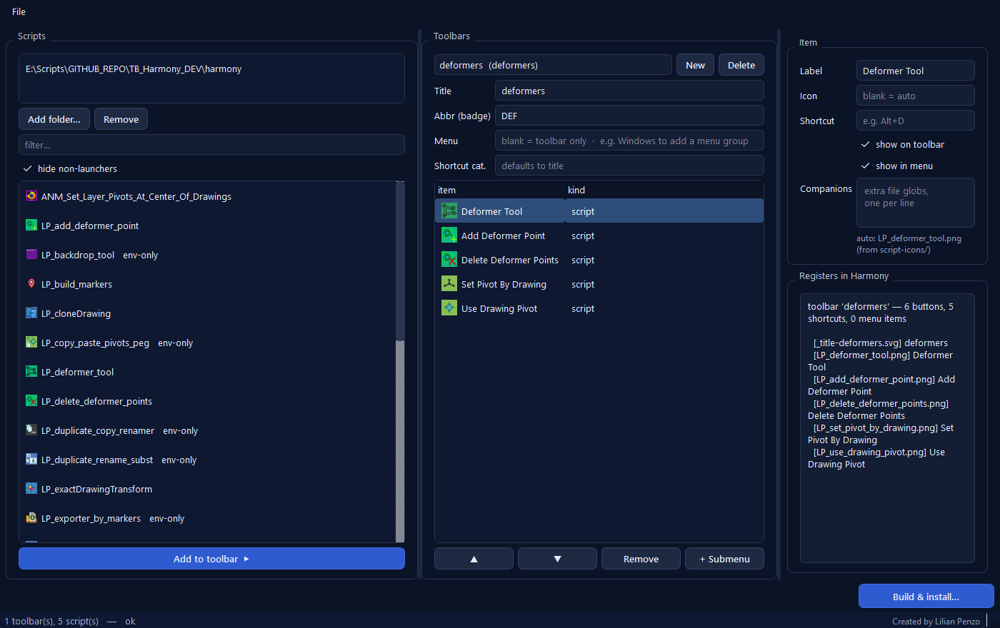

# Customize Toolbars

Turn your Toon Boom Harmony scripts into toolbars — buttons, shortcuts and an
optional menu — without hand-writing a `configure.js`. You arrange the toolbar in
a small desktop app and it produces a drop-in Harmony **package**.



- **Full guide:** [`docs/user-guide.md`](docs/user-guide.md)
- **Documentation page:** <https://naililian.github.io/LP_Harmony_Scripts-JS-PY/customize-toolbars.html>

## Requirements

- Windows, Toon Boom Harmony 21+ (tested on 24 / 25 / 27)
- Python 3.9+ (only to run the builder — **not** needed in Harmony)

## Run it

Double-click **`run.bat`** (first run creates a local `.venv` and installs the
three dependencies). Or manually:

```
py -3.9 -m venv .venv
.venv\Scripts\python -m pip install -r requirements.txt
set PYTHONPATH=%CD%
.venv\Scripts\python -m customize_toolbars_builder          REM the window
.venv\Scripts\python -m customize_toolbars_builder --help   REM the CLI
```

## In one minute

1. **New** toolbar → give it a Title and a 1–3 letter **Abbr** (the badge).
2. Point the left panel at your Harmony script folder, select scripts,
   **Add to toolbar ▶**.
3. Adjust each button's label / icon / suggested shortcut on the right.
4. Bottom-right **Build & install…** → tick your Harmony version(s).
5. Restart Harmony, right-click a toolbar area, enable your toolbar.

To change it later: **File ▸ Edit an installed toolbar package…**, edit, then
**Save changes to Harmony**.

## What ends up in Harmony

One package folder (`Customize_Toolbars/`) in
`%APPDATA%\Toon Boom Animation\<edition>\<NNNN>-scripts\packages\`, containing a
small engine, your `toolbars/*.json`, and copies of the scripts + icons it uses —
self-contained.

## Layout

```
run.bat                       launcher
requirements.txt
customize_toolbars_builder/   the app (models / services / ui + CLI)
  _bundled_package/           the engine, copied verbatim into every build
docs/                         user-guide.md
```

## License

MIT — see the repository `LICENSE`.
